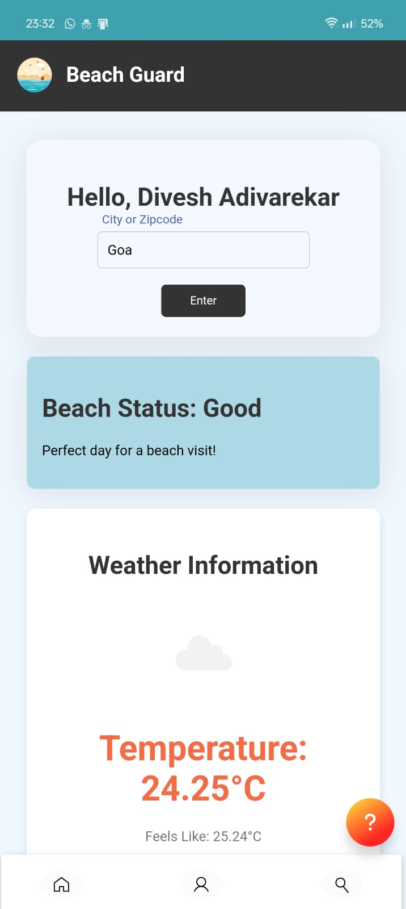
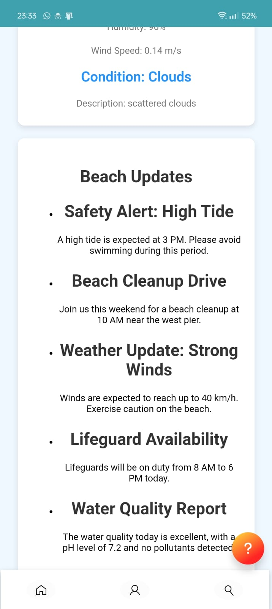

# SIH 2024

- **Problem Statement ID** – 1656
- **Problem Statement Title**- Development of a mobile application to provide recreational suitability information of beach locations across India.
- **Theme**- Travel & Tourism
- **PS Category**- Software
- **Team ID-** 20348
- **Team Name-** Tech_Warrior

# Beach Safety & Suitability App

This Android application provides real-time data to assess the suitability of beaches for recreational activities, ensuring safety and enjoyment for beachgoers. The app integrates various data sources like oceanic alerts, meteorological data, and water quality assessments, with an innovative AI model that ensures uninterrupted service even when external data is unavailable.

## Features

- **Real-Time Data**: The app gathers live data from trusted sources such as INCOIS, providing users with up-to-date beach conditions.
- **AI-Powered Predictions**: If external API data is unavailable, the app uses an AI model to predict sea-level conditions, ensuring continuous service.
- **Visual Indicators & Alerts**: The app provides easy-to-understand visual indicators and sends real-time alerts about beach safety conditions.
- **Personalized Notifications**: Users receive customized notifications based on their preferences and safety requirements.
- **WebView Interface**: The app uses a WebView widget to display content from an `index.html` file stored locally in the app's assets folder.

## Tech Stack

- **Android Studio**: Developed in Android Studio, using the **WebView widget** to display HTML content.
- **HTML/CSS**: The app's user interface is powered by a locally stored `index.html` file located in the `assets` folder, which is rendered within the WebView.
- **Java/Kotlin**: Core logic and functionality are implemented using Android's standard development tools in Java or Kotlin.
- **AI Model**: Integrated with an AI-based model for predicting beach conditions when real-time data is unavailable.

## How It Works

1. **WebView Integration**: The app loads an `index.html` file from the `assets` folder using the WebView widget, which provides the user interface.
2. **Data Integration**: Real-time beach data is sourced from INCOIS and other meteorological sources.
3. **AI Predictions**: When real-time data is unavailable, the app switches to AI-powered predictions to provide continuous updates on beach safety.
4. **User Notifications**: Personalized alerts and notifications about beach conditions are displayed based on user preferences and location.

## Installation

- Download the app directly from the [Releases section](https://github.com/diveshadivarekar/SIH-2024/releases/tag/prototype).
- [click here to download  for Android Phone](https://github.com/diveshadivarekar/SIH-2024/releases/download/prototype/Beach.Guard.apk)

## Usage

- Launch the app and allow it to access location and internet data.
- The app will automatically fetch and display beach safety information.
- If Real Time data is unavailable, the app's AI model will predict sea-level conditions to ensure uninterrupted service.

## Screenshots

  
  
  

## Future Enhancements

- **Multilingual Support**: Add support for regional languages to cater to a broader audience.
- **Blockchain Integration**: Implement blockchain technology to ensure the transparency and authenticity of safety data.
- **Local Shop Integration**: Include dynamic updates from nearby shops selling beach gear or services.

## License

This project is licensed - see the [LICENSE](LICENSE) file for details.